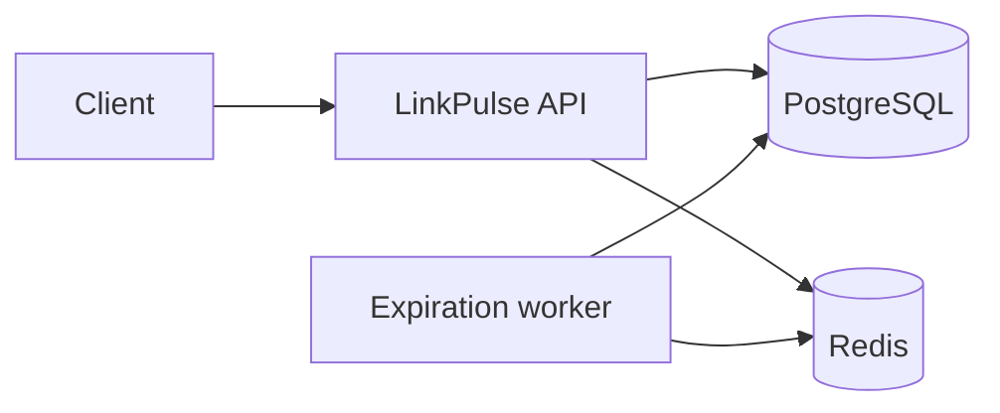

# LinkPulse API

[](https://github.com/foolin1/linkpulse-api/actions/workflows/ci.yml)
[](https://github.com/foolin1/linkpulse-api/releases)
[](https://dotnet.microsoft.com/)
[](https://www.postgresql.org/)
[](https://redis.io/)

LinkPulse is a URL shortener and click analytics API built with ASP.NET Core Minimal API, PostgreSQL and Redis.

The project demonstrates backend development beyond basic CRUD: JWT authentication, cache-aside, cache invalidation, rate limiting, background processing, analytics, Testcontainers, Docker Compose and CI.

## Features

- User registration and login with JWT access tokens.
- Secure password hashing through ASP.NET Core Identity.
- Automatic short-code generation.
- Custom aliases with uniqueness validation.
- Link expiration and soft deactivation.
- Public `302 Found` redirects.
- Redis cache-aside with PostgreSQL fallback.
- Cache invalidation after link updates and deactivation.
- Click-event collection with referrer and user-agent data.
- Time-series analytics and top referrers.
- Paginated click-event history.
- Per-user link-creation rate limits.
- Per-IP redirect rate limits.
- Background cleanup of expired links.
- ProblemDetails error responses.
- Liveness and readiness health checks.
- PostgreSQL and Redis integration tests with Testcontainers.
- Multi-stage Docker image and full Docker Compose environment.
- GitHub Actions CI.

## Technology stack

| Area | Technology |
|---|---|
| Runtime | .NET 10 |
| API | ASP.NET Core Minimal API |
| Persistence | Entity Framework Core |
| Database | PostgreSQL 17 |
| Cache | Redis 7.4 |
| Authentication | JWT Bearer |
| Password hashing | ASP.NET Core Identity |
| Testing | xUnit, WebApplicationFactory, Testcontainers |
| Containers | Docker, Docker Compose |
| CI | GitHub Actions |

## Architecture



A detailed architecture description, redirect sequence and ER model are available in [docs/architecture.md](docs/architecture.md).

## API contracts

| Scenario | Status |
|---|---:|
| Successful registration | `201 Created` |
| Successful login | `200 OK` |
| Link created | `201 Created` |
| Invalid request | `400 Bad Request` |
| Missing or invalid token | `401 Unauthorized` |
| Unknown or foreign link | `404 Not Found` |
| Duplicate email or alias | `409 Conflict` |
| Disabled or expired short link | `410 Gone` |
| Rate limit exceeded | `429 Too Many Requests` |
| Successful redirect | `302 Found` |

## Quick start with Docker Compose

### Requirements

- Docker Desktop or Docker Engine with Docker Compose.

### 1. Create local configuration

PowerShell:

```powershell
Copy-Item .env.example .env

$jwtKey = [Guid]::NewGuid().ToString("N") +
    [Guid]::NewGuid().ToString("N")

(Get-Content .env) `
    -replace '^JWT_SIGNING_KEY=.*$', "JWT_SIGNING_KEY=$jwtKey" |
    Set-Content .env
```

### 2. Start the application

```powershell
docker compose up -d --build
```

Docker Compose starts:

- PostgreSQL;
- Redis;
- a one-time EF Core migration container;
- LinkPulse API.

### 3. Check the application

```powershell
docker compose ps -a
```

```powershell
curl.exe http://localhost:5080/health/ready
```

```powershell
curl.exe http://localhost:5080/version
```

### 4. Stop the application

```powershell
docker compose down
```

To remove local PostgreSQL and Redis data:

```powershell
docker compose down -v
```

## Local development

### Requirements

- .NET SDK 10;
- Docker Desktop;
- PowerShell.

Start infrastructure:

```powershell
docker compose up -d postgres redis
```

Restore tools and packages:

```powershell
dotnet tool restore
dotnet restore LinkPulse.sln
```

Apply migrations:

```powershell
dotnet ef database update `
    --project src/LinkPulse.Api `
    --startup-project src/LinkPulse.Api
```

Create a development JWT key:

```powershell
$jwtKey = [Guid]::NewGuid().ToString("N") +
    [Guid]::NewGuid().ToString("N")

dotnet user-secrets set `
    "Jwt:SigningKey" `
    $jwtKey `
    --project src/LinkPulse.Api
```

Run the API:

```powershell
dotnet run --project src/LinkPulse.Api
```

Development address:

```text
http://localhost:5080
```

OpenAPI document:

```text
http://localhost:5080/openapi/v1.json
```

## Configuration

| Setting | Default |
|---|---:|
| JWT access-token lifetime | 60 minutes |
| Redis cache TTL | 15 minutes |
| Link-creation limit | 10 requests per 60 seconds |
| Redirect limit | 60 requests per 60 seconds |
| Expiration cleanup interval | 60 seconds |
| Expiration cleanup batch size | 100 |
| Maximum analytics range | 90 days |
| Maximum page size | 100 |

Sensitive configuration is not stored in the repository.

Use:

- .NET User Secrets for local development;
- environment variables or a secret store for containers and deployed environments.

## API examples

### Register

```powershell
$registerBody = @{
    email = "owner@example.com"
    password = "LinkPulse123"
} | ConvertTo-Json

$registration = Invoke-RestMethod `
    -Method Post `
    -Uri "http://localhost:5080/api/auth/register" `
    -ContentType "application/json" `
    -Body $registerBody

$token = $registration.accessToken

$headers = @{
    Authorization = "Bearer $token"
}
```

### Create a short link

```powershell
$createBody = @{
    targetUrl = "https://learn.microsoft.com/dotnet/"
    customAlias = "dotnet-docs"
    expiresAt = $null
} | ConvertTo-Json

$link = Invoke-RestMethod `
    -Method Post `
    -Uri "http://localhost:5080/api/links" `
    -Headers $headers `
    -ContentType "application/json" `
    -Body $createBody

$link
```

### Use the short link

```powershell
curl.exe `
    -i `
    "http://localhost:5080/dotnet-docs"
```

The first request returns:

```text
HTTP/1.1 302 Found
X-LinkPulse-Cache: MISS
```

A repeated request normally returns:

```text
HTTP/1.1 302 Found
X-LinkPulse-Cache: HIT
```

When Redis is unavailable and PostgreSQL resolves the link:

```text
X-LinkPulse-Cache: BYPASS
```

### Get analytics

```powershell
Invoke-RestMethod `
    -Method Get `
    -Uri "http://localhost:5080/api/links/$($link.id)/analytics" `
    -Headers $headers |
    ConvertTo-Json -Depth 10
```

### Get paginated events

```powershell
Invoke-RestMethod `
    -Method Get `
    -Uri "http://localhost:5080/api/links/$($link.id)/events?page=1&pageSize=20" `
    -Headers $headers |
    ConvertTo-Json -Depth 10
```

## Cache-aside behavior

PostgreSQL is the source of truth.

For a redirect request LinkPulse:

1. checks Redis;
2. returns a cached target URL on cache hit;
3. queries PostgreSQL on cache miss;
4. stores an active link in Redis with a limited TTL;
5. falls back to PostgreSQL when Redis is unavailable;
6. records a click event for every successful redirect.

Redis entries are invalidated after:

- target URL updates;
- link deactivation;
- expiration cleanup;
- detection of stale or invalid cached data.

## Background expiration

`ExpiredLinkCleanupWorker` runs periodically and processes expired links in batches.

Expired links are:

- marked inactive in PostgreSQL;
- removed from Redis;
- returned as `410 Gone` by the public redirect endpoint.

## Testing

Docker must be available because integration tests create temporary PostgreSQL and Redis containers.

Run all tests:

```powershell
dotnet test LinkPulse.sln --configuration Release
```

Run only unit tests:

```powershell
dotnet test `
    tests/LinkPulse.UnitTests/LinkPulse.UnitTests.csproj `
    --configuration Release
```

Run only integration tests:

```powershell
dotnet test `
    tests/LinkPulse.IntegrationTests/LinkPulse.IntegrationTests.csproj `
    --configuration Release
```

Integration coverage includes:

- registration and login;
- JWT-protected endpoints;
- generated short codes;
- custom alias conflicts;
- invalid URL validation;
- redirect `404` and `410` contracts;
- Redis cache miss and hit;
- cache invalidation;
- ownership isolation;
- click analytics;
- event pagination;
- rate limiting.

## Health checks

| Endpoint | Purpose |
|---|---|
| `/health/live` | Process liveness |
| `/health/ready` | PostgreSQL and Redis readiness |
| `/health` | Full dependency health |

## Project structure

```text
linkpulse-api/
├── .github/workflows/
├── docs/
├── src/
│   └── LinkPulse.Api/
│       ├── Authentication/
│       ├── Caching/
│       ├── Data/
│       ├── Expiration/
│       ├── Features/
│       ├── HealthChecks/
│       ├── RateLimiting/
│       ├── Dockerfile
│       └── Program.cs
├── tests/
│   ├── LinkPulse.UnitTests/
│   └── LinkPulse.IntegrationTests/
├── docker-compose.yml
├── Directory.Build.props
├── LinkPulse.sln
└── README.md
```

## Design decisions

### PostgreSQL as the source of truth

Redis improves redirect performance but does not own application state. Redis failure therefore does not make existing links unavailable.

### Soft deactivation

Deleting a link changes `IsActive` instead of deleting the database row. This preserves analytics and ownership history.

### `410 Gone` for expired links

An existing but unavailable link returns `410 Gone`. An unknown code returns `404 Not Found`.

### Owner-scoped queries

Management and analytics queries include both the link identifier and authenticated owner identifier. Requests for another user's link return `404`.

### Best-effort click recording

A temporary analytics write failure is logged but does not block a valid redirect.

## CI

GitHub Actions performs:

1. package restore;
2. formatting verification;
3. Release build;
4. unit and Testcontainers integration tests;
5. dependency vulnerability scan;
6. Docker Compose build;
7. full-stack startup and health-check smoke test.

## Current limitations

The `v1.0.0` release intentionally does not include:

- refresh tokens;
- email confirmation;
- password recovery;
- custom domains;
- browser or device parsing;
- distributed rate limiting;
- a frontend application.

These features are outside the scope of the portfolio version.