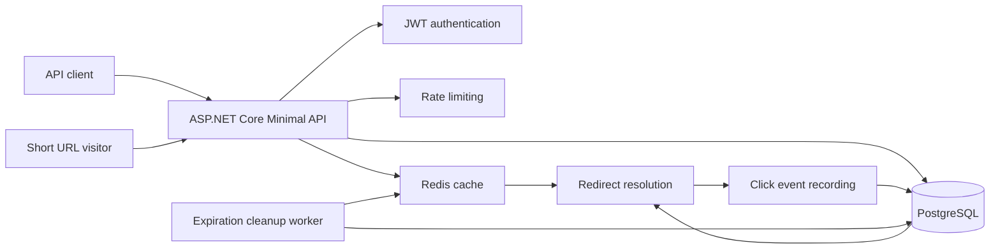
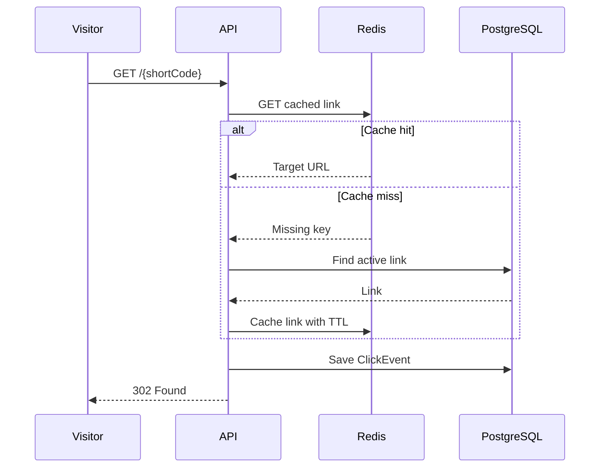
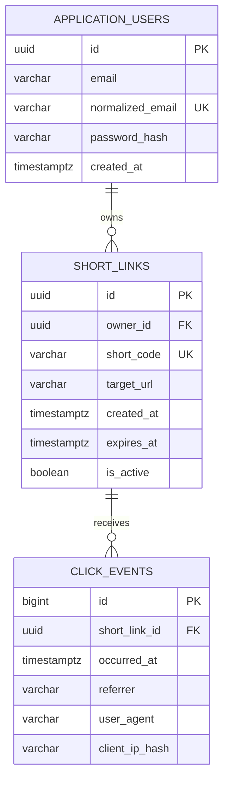

# LinkPulse Architecture

## System overview

## Redirect flow

## Cache invalidation

The Redis entry is removed when:

- the target URL is updated;
- a link is disabled;
- the expiration worker deactivates an expired link;
- an invalid or stale cached value is detected.

PostgreSQL remains the source of truth. Redis failure does not prevent redirects: the API falls back to PostgreSQL.

## Database model

## Background processing

`ExpiredLinkCleanupWorker` periodically selects active links whose `ExpiresAt` value is in the past.

For every batch it:

1. marks links as inactive in PostgreSQL;
2. commits the database transaction;
3. removes matching Redis keys;
4. logs the number of processed links.

A failed cleanup iteration is logged and retried during the next interval.

## Security boundaries

- Passwords are stored only as ASP.NET Core Identity password hashes.
- JWT signing keys are supplied through User Secrets or environment variables.
- Link-management and analytics endpoints require authentication.
- Database queries include the authenticated owner identifier.
- Foreign links return `404` instead of exposing their existence.
- Only absolute HTTP and HTTPS target URLs are accepted.